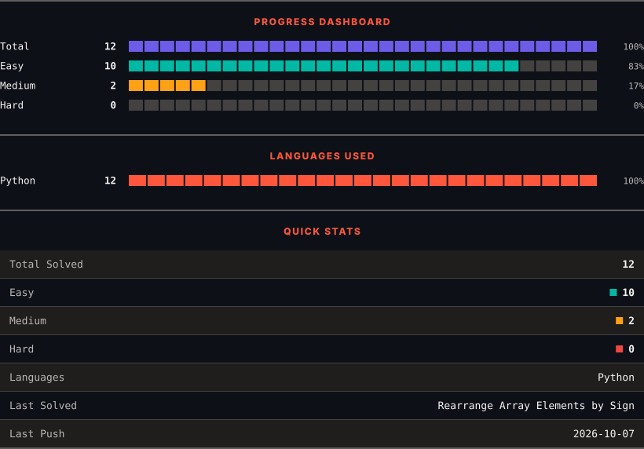
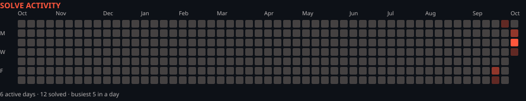

<h1>LeetCode Solutions</h1>

<em>Automatically synced with every accepted submission</em>

   

<picture>
  <source media="(prefers-color-scheme: dark)" srcset=".leetsync/stats-dark.svg">
  <source media="(prefers-color-scheme: light)" srcset=".leetsync/stats-light.svg">
  
</picture>

<picture>
  <source media="(prefers-color-scheme: dark)" srcset=".leetsync/calendar-dark.svg">
  <source media="(prefers-color-scheme: light)" srcset=".leetsync/calendar-light.svg">
  
</picture>

---

### ALL SOLUTIONS

| # | Problem | Difficulty | Language | Date |
|:---:|:--------|:----------:|:--------:|:----:|
| 14 | [Longest Common Prefix](problems/0014-Longest-Common-Prefix) | 🟩 Easy | `Python` | 2026-09-27 |
| 26 | [Remove Duplicates from Sorted Array](problems/0026-Remove-Duplicates-from-Sorted-Array) | 🟩 Easy | `Python` | 2026-10-06 |
| 125 | [Valid Palindrome](problems/0125-Valid-Palindrome) | 🟩 Easy | `Python` | 2026-09-25 |
| 169 | [Majority Element](problems/0169-Majority-Element) | 🟩 Easy | `Python` | 2026-10-06 |
| 189 | [Rotate Array](problems/0189-Rotate-Array) | 🟧 Medium | `Python` | 2026-10-05 |
| 205 | [Isomorphic Strings](problems/0205-Isomorphic-Strings) | 🟩 Easy | `Python` | 2026-09-26 |
| 268 | [Missing Number](problems/0268-Missing-Number) | 🟩 Easy | `Python` | 2026-10-06 |
| 283 | [Move Zeroes](problems/0283-Move-Zeroes) | 🟩 Easy | `Python` | 2026-10-06 |
| 485 | [Max Consecutive Ones](problems/0485-Max-Consecutive-Ones) | 🟩 Easy | `Python` | 2026-10-05 |
| 1903 | [Largest Odd Number in String](problems/1903-Largest-Odd-Number-in-String) | 🟩 Easy | `Python` | 2026-09-25 |
| 2149 | [Rearrange Array Elements by Sign](problems/2149-Rearrange-Array-Elements-by-Sign) | 🟧 Medium | `Python` | 2026-10-06 |

---

Auto-synced by <strong>LeetSync</strong> · Built by <a href="https://deveshsamant.in/">Devesh Samant</a>

