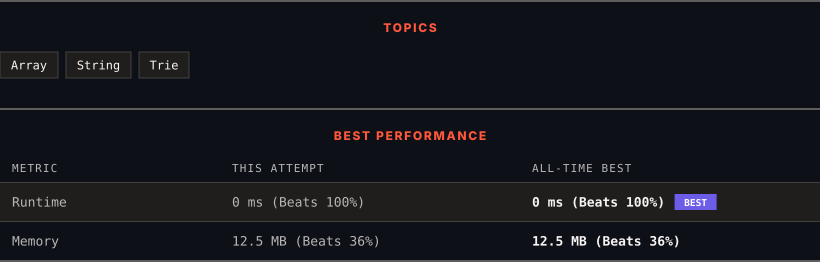

<div align="center">

# 14. Longest Common Prefix

      

[](https://leetcode.com/problems/longest-common-prefix/)

</div>

---

<div align="center">

<picture>
  <source media="(prefers-color-scheme: dark)" srcset="panel-dark.svg">
  <source media="(prefers-color-scheme: light)" srcset="panel-light.svg">
  
</picture>

</div>

> **New personal best** — Runtime improved on this submission.

### HOW IT WENT

| | |
|:--|:--|
| **Attempts** | first try |
| **Time to solve** | 51 h 11 min |
| **Verdicts** | ✅ Accepted |

---

### NOTES

_No notes yet._

---

### SOLUTIONS (1)

| # | File | Language | Date |
|:-:|------|:--------:|:----:|
| 1 | [sol1.py](./sol1.py) | `Python` | 2026-09-27 ← **latest** |

---

### PROBLEM DESCRIPTION

Write a function to find the longest common prefix string amongst an array of strings.

If there is no common prefix, return an empty string `""`.

 

**Example 1:**

```

**Input:** strs = ["flower","flow","flight"]
**Output:** "fl"

```

**Example 2:**

```

**Input:** strs = ["dog","racecar","car"]
**Output:** ""
**Explanation:** There is no common prefix among the input strings.

```

 

**Constraints:**

	- `1 <= strs.length <= 200`

	- `0 <= strs[i].length <= 200`

	- `strs[i]` consists of only lowercase English letters if it is non-empty.

---

<div align="center">

<sub>Auto-synced by <strong>LeetSync</strong> · Built by <a href="https://deveshsamant.in/">Devesh Samant</a></sub>

</div>
