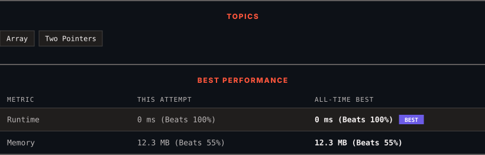

<div align="center">

# 27. Remove Element

      

[](https://leetcode.com/problems/remove-element/)

</div>

---

<div align="center">

<picture>
  <source media="(prefers-color-scheme: dark)" srcset="panel-dark.svg">
  <source media="(prefers-color-scheme: light)" srcset="panel-light.svg">
  
</picture>

</div>

> **New personal best** — Runtime improved on this submission.

### HOW IT WENT

| | |
|:--|:--|
| **Attempts** | first try |
| **Time to solve** | 39 min |
| **Verdicts** | ✅ Accepted |

---

### NOTES

_No notes yet._

---

### SOLUTIONS (1)

| # | File | Language | Date |
|:-:|------|:--------:|:----:|
| 1 | [sol1.py](./sol1.py) | `Python` | 2026-10-10 ← **latest** |

---

### PROBLEM DESCRIPTION

Given an integer array `nums` and an integer `val`, remove all occurrences of `val` in `nums` [**in-place**](https://en.wikipedia.org/wiki/In-place_algorithm). The order of the elements may be changed. Then return *the number of elements in *`nums`* which are not equal to *`val`.

Consider the number of elements in `nums` which are not equal to `val` be `k`, to get accepted, you need to do the following things:

	- Change the array `nums` such that the first `k` elements of `nums` contain the elements which are not equal to `val`. The remaining elements of `nums` are not important as well as the size of `nums`.

	- Return `k`.

**Custom Judge:**

The judge will test your solution with the following code:

```

int[] nums = [...]; // Input array
int val = ...; // Value to remove
int[] expectedNums = [...]; // The expected answer with correct length.
                            // It is sorted with no values equaling val.

int k = removeElement(nums, val); // Calls your implementation

assert k == expectedNums.length;
sort(nums, 0, k); // Sort the first k elements of nums
for (int i = 0; i < actualLength; i++) {
    assert nums[i] == expectedNums[i];
}

```

If all assertions pass, then your solution will be **accepted**.

 

**Example 1:**

```

**Input:** nums = [3,2,2,3], val = 3
**Output:** 2, nums = [2,2,_,_]
**Explanation:** Your function should return k = 2, with the first two elements of nums being 2.
It does not matter what you leave beyond the returned k (hence they are underscores).

```

**Example 2:**

```

**Input:** nums = [0,1,2,2,3,0,4,2], val = 2
**Output:** 5, nums = [0,1,4,0,3,_,_,_]
**Explanation:** Your function should return k = 5, with the first five elements of nums containing 0, 0, 1, 3, and 4.
Note that the five elements can be returned in any order.
It does not matter what you leave beyond the returned k (hence they are underscores).

```

 

**Constraints:**

	- `0 <= nums.length <= 100`

	- `0 <= nums[i] <= 50`

	- `0 <= val <= 100`

---

<div align="center">

<sub>Auto-synced by <strong>LeetSync</strong> · Built by <a href="https://deveshsamant.in/">Devesh Samant</a></sub>

</div>
