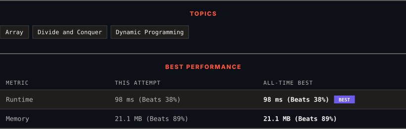

<div align="center">

# 53. Maximum Subarray

      

[](https://leetcode.com/problems/maximum-subarray/)

</div>

---

<div align="center">

<picture>
  <source media="(prefers-color-scheme: dark)" srcset="panel-dark.svg">
  <source media="(prefers-color-scheme: light)" srcset="panel-light.svg">
  
</picture>

</div>

> **New personal best** — Runtime improved on this submission.

### HOW IT WENT

| | |
|:--|:--|
| **Attempts** | first try |
| **Time to solve** | 14 h 12 min |
| **Verdicts** | ✅ Accepted |

---

### NOTES

_No notes yet._

---

### SOLUTIONS (1)

| # | File | Language | Date |
|:-:|------|:--------:|:----:|
| 1 | [sol1.py](./sol1.py) | `Python` | 2026-10-08 ← **latest** |

---

### PROBLEM DESCRIPTION

Given an integer array `nums`, find the subarray with the largest sum, and return *its sum*.

 

**Example 1:**

```

**Input:** nums = [-2,1,-3,4,-1,2,1,-5,4]
**Output:** 6
**Explanation:** The subarray [4,-1,2,1] has the largest sum 6.

```

**Example 2:**

```

**Input:** nums = [1]
**Output:** 1
**Explanation:** The subarray [1] has the largest sum 1.

```

**Example 3:**

```

**Input:** nums = [5,4,-1,7,8]
**Output:** 23
**Explanation:** The subarray [5,4,-1,7,8] has the largest sum 23.

```

 

**Constraints:**

	- `1 <= nums.length <= 10^5`

	- `-10^4 <= nums[i] <= 10^4`

 

**Follow up:** If you have figured out the `O(n)` solution, try coding another solution using the **divide and conquer** approach, which is more subtle.

---

<div align="center">

<sub>Auto-synced by <strong>LeetSync</strong> · Built by <a href="https://deveshsamant.in/">Devesh Samant</a></sub>

</div>
