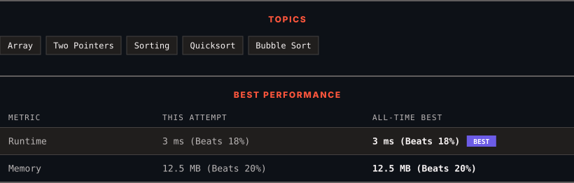

# 75. Sort Colors

      

---

<picture>
  <source media="(prefers-color-scheme: dark)" srcset="panel-dark.svg">
  <source media="(prefers-color-scheme: light)" srcset="panel-light.svg">
  
</picture>

> **New personal best** — Runtime improved on this submission.

### HOW IT WENT

| | |
|:--|:--|
| **Attempts** | first try |
| **Time to solve** | 52 min |
| **Verdicts** | ✅ Accepted |

---

### NOTES

_No notes yet._

---

### SOLUTIONS (1)

| # | File | Language | Date |
|:-:|------|:--------:|:----:|
| 1 | [sol1.py](./sol1.py) | `Python` | 2026-10-07 ← **latest** |

---

### PROBLEM DESCRIPTION

You are given an array `nums` with `n` objects colored red, white, or blue, sort them **[in-place](https://en.wikipedia.org/wiki/In-place_algorithm) **so that objects of the same color are adjacent, with the colors in the order red, white, and blue.

We will use the integers 0, 1, and 2 to represent the color red, white, and blue, respectively.

You must solve this problem without using the library's sort function.

 

**Example 1:**

**Input:** nums = [2,0,2,1,1,0]

**Output:** [0,0,1,1,2,2]

**Explanation:**

The array has two 0s, two 1s, and two 2s. Sorting them in-place places all 0s first, then all 1s, then all 2s.

**Example 2:**

**Input:** nums = [2,0,1]

**Output:** [0,1,2]

**Explanation:**

The array has one each of 0, 1, and 2, arranged in-place in the order 0, 1, 2.

 

**Constraints:**

	- `n == nums.length`

	- `1 <= n <= 300`

	- `nums[i]` is either 0, 1, or 2.

 

**Follow up:** Could you come up with a one-pass algorithm using only constant extra space?

---

Auto-synced by <strong>LeetSync</strong> · Built by <a href="https://deveshsamant.in/">Devesh Samant</a>

