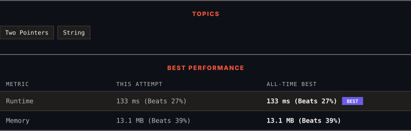

<div align="center">

# 125. Valid Palindrome

      

[](https://leetcode.com/problems/valid-palindrome/)

</div>

---

<div align="center">

<picture>
  <source media="(prefers-color-scheme: dark)" srcset="panel-dark.svg">
  <source media="(prefers-color-scheme: light)" srcset="panel-light.svg">
  
</picture>

</div>

> **New personal best** — Runtime improved on this submission.

### HOW IT WENT

| | |
|:--|:--|
| **Attempts** | first try |
| **Time to solve** | 20 min |
| **Verdicts** | ✅ Accepted |

---

### NOTES

_No notes yet._

---

### SOLUTIONS (1)

| # | File | Language | Date |
|:-:|------|:--------:|:----:|
| 1 | [sol1.py](./sol1.py) | `Python` | 2026-09-25 ← **latest** |

---

### PROBLEM DESCRIPTION

A phrase is a **palindrome** if, after converting all uppercase letters into lowercase letters and removing all non-alphanumeric characters, it reads the same forward and backward. Alphanumeric characters include letters and numbers.

Given a string `s`, return `true`* if it is a **palindrome**, or *`false`* otherwise*.

 

**Example 1:**

```

**Input:** s = "A man, a plan, a canal: Panama"
**Output:** true
**Explanation:** "amanaplanacanalpanama" is a palindrome.

```

**Example 2:**

```

**Input:** s = "race a car"
**Output:** false
**Explanation:** "raceacar" is not a palindrome.

```

**Example 3:**

```

**Input:** s = " "
**Output:** true
**Explanation:** s is an empty string "" after removing non-alphanumeric characters.
Since an empty string reads the same forward and backward, it is a palindrome.

```

 

**Constraints:**

	- `1 <= s.length <= 2 * 10^5`

	- `s` consists only of printable ASCII characters.

---

<div align="center">

<sub>Auto-synced by <strong>LeetSync</strong> · Built by <a href="https://deveshsamant.in/">Devesh Samant</a></sub>

</div>
