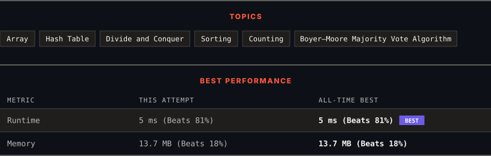

<div align="center">

# 169. Majority Element

      

[](https://leetcode.com/problems/majority-element/)

</div>

---

<div align="center">

<picture>
  <source media="(prefers-color-scheme: dark)" srcset="panel-dark.svg">
  <source media="(prefers-color-scheme: light)" srcset="panel-light.svg">
  
</picture>

</div>

> **New personal best** — Runtime improved on this submission.

### HOW IT WENT

| | |
|:--|:--|
| **Attempts** | first try |
| **Time to solve** | 1 min |
| **Verdicts** | ✅ Accepted |

---

### NOTES

_No notes yet._

---

### SOLUTIONS (1)

| # | File | Language | Date |
|:-:|------|:--------:|:----:|
| 1 | [sol1.py](./sol1.py) | `Python` | 2026-10-06 ← **latest** |

---

### PROBLEM DESCRIPTION

Given an array `nums` of size `n`, return *the majority element*.

The majority element is the element that appears more than `&lfloor;n / 2&rfloor;` times. You may assume that the majority element always exists in the array.

 

**Example 1:**

```
**Input:** nums = [3,2,3]
**Output:** 3

```

**Example 2:**

```
**Input:** nums = [2,2,1,1,1,2,2]
**Output:** 2

```

 

**Constraints:**

	- `n == nums.length`

	- `1 <= n <= 5 * 10^4`

	- `-10^9 <= nums[i] <= 10^9`

	- The input is generated such that a majority element will exist in the array.

 

**Follow-up:** Could you solve the problem in linear time and in `O(1)` space?

---

<div align="center">

<sub>Auto-synced by <strong>LeetSync</strong> · Built by <a href="https://deveshsamant.in/">Devesh Samant</a></sub>

</div>
