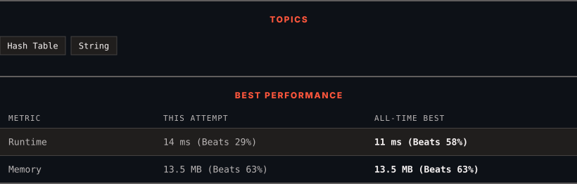

# 205. Isomorphic Strings

      

---

<picture>
  <source media="(prefers-color-scheme: dark)" srcset="panel-dark.svg">
  <source media="(prefers-color-scheme: light)" srcset="panel-light.svg">
  
</picture>

### HOW IT WENT

| | |
|:--|:--|
| **Attempts** | 3 before accepted |
| **Time to solve** | 19 h 34 min |
| **Verdicts** | ❌ Wrong Answer → ✅ Accepted → ✅ Accepted |

---

### NOTES

_No notes yet._

---

### SOLUTIONS (2)

| # | File | Language | Date |
|:-:|------|:--------:|:----:|
| 1 | [sol1.py](./sol1.py) | `Python` | 2026-09-26 |
| 2 | [sol2.py](./sol2.py) | `Python` | 2026-09-26 ← **latest** |

---

### PROBLEM DESCRIPTION

Given two strings `s` and `t`, *determine if they are isomorphic*.

Two strings `s` and `t` are isomorphic if the characters in `s` can be replaced to get `t`.

All occurrences of a character must be replaced with another character while preserving the order of characters. No two characters may map to the same character, but a character may map to itself.

 

**Example 1:**

**Input:** s = "egg", t = "add"

**Output:** true

**Explanation:**

The strings `s` and `t` can be made identical by:

	- Mapping `'e'` to `'a'`.

	- Mapping `'g'` to `'d'`.

**Example 2:**

**Input:** s = "f11", t = "b23"

**Output:** false

**Explanation:**

The strings `s` and `t` can not be made identical as `'1'` needs to be mapped to both `'2'` and `'3'`.

**Example 3:**

**Input:** s = "paper", t = "title"

**Output:** true

 

**Constraints:**

	- `1 <= s.length <= 5 * 10^4`

	- `t.length == s.length`

	- `s` and `t` consist of any valid ascii character.

---

Auto-synced by <strong>LeetSync</strong> · Built by <a href="https://deveshsamant.in/">Devesh Samant</a>

