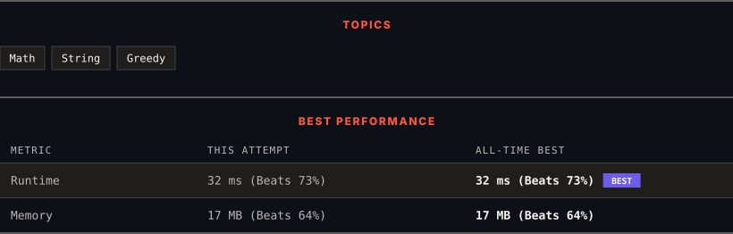

<div align="center">

# 1903. Largest Odd Number in String

      

[](https://leetcode.com/problems/largest-odd-number-in-string/)

</div>

---

<div align="center">

<picture>
  <source media="(prefers-color-scheme: dark)" srcset="panel-dark.svg">
  <source media="(prefers-color-scheme: light)" srcset="panel-light.svg">
  
</picture>

</div>

> **New personal best** — Runtime improved on this submission.

### HOW IT WENT

| | |
|:--|:--|
| **Attempts** | first try |
| **Time to solve** | 23 min |
| **Verdicts** | ✅ Accepted |

---

### NOTES

_No notes yet._

---

### SOLUTIONS (1)

| # | File | Language | Date |
|:-:|------|:--------:|:----:|
| 1 | [sol1.py](./sol1.py) | `Python` | 2026-09-25 ← **latest** |

---

### PROBLEM DESCRIPTION

You are given a string `num`, representing a large integer. Return *the **largest-valued odd** integer (as a string) that is a **non-empty substring** of *`num`*, or an empty string *`""`* if no odd integer exists*.

A **substring** is a contiguous sequence of characters within a string.

 

**Example 1:**

```

**Input:** num = "52"
**Output:** "5"
**Explanation:** The only non-empty substrings are "5", "2", and "52". "5" is the only odd number.

```

**Example 2:**

```

**Input:** num = "4206"
**Output:** ""
**Explanation:** There are no odd numbers in "4206".

```

**Example 3:**

```

**Input:** num = "35427"
**Output:** "35427"
**Explanation:** "35427" is already an odd number.

```

 

**Constraints:**

	- `1 <= num.length <= 10^5`

	- `num` only consists of digits and does not contain any leading zeros.

---

<div align="center">

<sub>Auto-synced by <strong>LeetSync</strong> · Built by <a href="https://deveshsamant.in/">Devesh Samant</a></sub>

</div>
