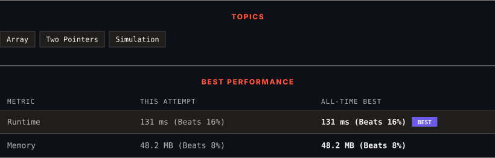

<div align="center">

# 2149. Rearrange Array Elements by Sign

      

[](https://leetcode.com/problems/rearrange-array-elements-by-sign/)

</div>

---

<div align="center">

<picture>
  <source media="(prefers-color-scheme: dark)" srcset="panel-dark.svg">
  <source media="(prefers-color-scheme: light)" srcset="panel-light.svg">
  
</picture>

</div>

> **New personal best** — Runtime improved on this submission.

### HOW IT WENT

| | |
|:--|:--|
| **Attempts** | first try |
| **Time to solve** | 12 min |
| **Verdicts** | ✅ Accepted |

---

### NOTES

_No notes yet._

---

### SOLUTIONS (1)

| # | File | Language | Date |
|:-:|------|:--------:|:----:|
| 1 | [sol1.py](./sol1.py) | `Python` | 2026-10-06 ← **latest** |

---

### PROBLEM DESCRIPTION

You are given a **0-indexed** integer array `nums` of **even** length consisting of an **equal** number of positive and negative integers.

You should return the array of nums such that the array follows the given conditions:

	- Every **consecutive pair** of integers have **opposite signs**.

	- For all integers with the same sign, the **order** in which they were present in `nums` is **preserved**.

	- The rearranged array begins with a positive integer.

Return *the modified array after rearranging the elements to satisfy the aforementioned conditions*.

 

**Example 1:**

```

**Input:** nums = [3,1,-2,-5,2,-4]
**Output:** [3,-2,1,-5,2,-4]
**Explanation:**
The positive integers in nums are [3,1,2]. The negative integers are [-2,-5,-4].
The only possible way to rearrange them such that they satisfy all conditions is [3,-2,1,-5,2,-4].
Other ways such as [1,-2,2,-5,3,-4], [3,1,2,-2,-5,-4], [-2,3,-5,1,-4,2] are incorrect because they do not satisfy one or more conditions.  

```

**Example 2:**

```

**Input:** nums = [-1,1]
**Output:** [1,-1]
**Explanation:**
1 is the only positive integer and -1 the only negative integer in nums.
So nums is rearranged to [1,-1].

```

 

**Constraints:**

	- `2 <= nums.length <= 2 * 10^5`

	- `nums.length` is **even**

	- `1 <= |nums[i]| <= 10^5`

	- `nums` consists of **equal** number of positive and negative integers.

 

It is not required to do the modifications in-place.

---

<div align="center">

<sub>Auto-synced by <strong>LeetSync</strong> · Built by <a href="https://deveshsamant.in/">Devesh Samant</a></sub>

</div>
